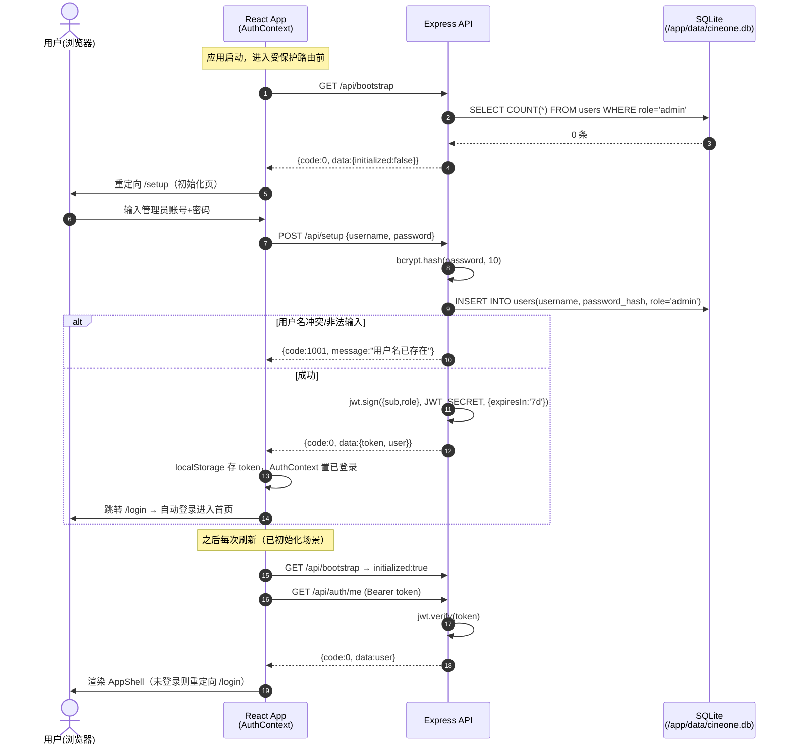
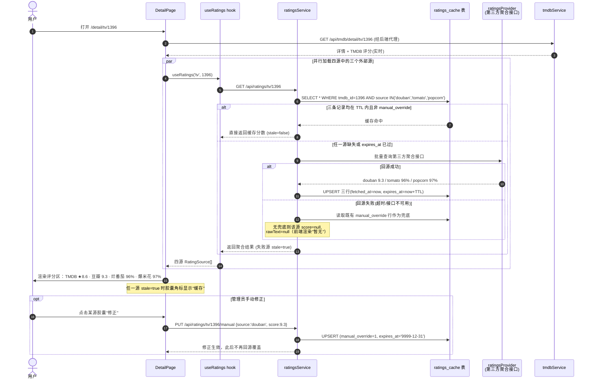

# CineOne 影视聚合应用 · 系统架构设计文档

| 项目 | 内容 |
| --- | --- |
| 文档版本 | v1.0 |
| 上游输入 | PRD v1.0（产品经理 Alice） |
| 作者 | 架构师 Bob（高见远） |
| 技术栈 | Node.js (Express) + better-sqlite3 / Vite + React + TypeScript + Tailwind CSS |
| 部署形态 | Docker 单容器，SQLite 数据卷 `/app/data` |

---

## Part A · 系统设计

### 1. 实现方案与框架选型

#### 1.1 核心技术挑战分析

| 挑战 | 分析与对策 |
| --- | --- |
| TMDB API 代理与配额保护 | API Key 存于后端 SQLite，前端**永不接触 Key**；所有 TMDB 请求经后端代理转发，统一注入 Key、错误处理与超时控制 |
| 四源评分聚合（豆瓣/烂番茄/爆米花/TMDB） | 豆瓣、烂番茄无官方 API → 采用**第三方聚合接口 + SQLite 缓存 + 手动修正兜底**三层策略：TMDB 实时取；其余源优先读缓存（TTL 内直接命中），过期则回源第三方接口，失败则回退手动修正值或显示"暂无评分"；不做爬虫 |
| 鉴权与首次启动流程 | JWT 无状态鉴权；`/api/bootstrap` 暴露系统初始化状态，前端据此路由分流到「管理员初始化页」或「登录页」 |
| 追剧进度（季/集二级） | `current_season` + `current_episode` 双字段追踪，辅以 `seasons_snapshot` JSON 快照记录各季总集数，用于渲染进度条与选集器 |
| Apple HIG 视觉还原 | 不引入 MUI/Antd；以 Tailwind CSS + CSS 自定义属性（设计令牌）搭建自定义组件体系：毛玻璃材质、SF Pro 字体栈、深浅双主题、Remix Icon |
| Windows 开发环境兼容 | 全程使用 POSIX 风格相对路径；better-sqlite3 提供 prebuilt binaries；Dockerfile 基于 Linux 镜像规避本地编译差异 |

#### 1.2 框架与库选型及理由

| 层 | 选型 | 理由 |
| --- | --- | --- |
| 后端框架 | **Express@^4** | 生态最成熟、中间件模型简单、团队熟悉度高；单体小服务无需 Fastify 的极致性能 |
| SQLite 驱动 | **better-sqlite3@^11** | 同步 API 极简可靠、单文件零运维、性能优于 sql.js；契合"自托管 NAS"定位 |
| 鉴权 | **jsonwebtoken + bcryptjs** | JWT 无状态（水平扩展友好）；bcryptjs 纯 JS 实现在 Windows/Docker 均免编译问题 |
| 外部请求 | **内置 fetch（Node ≥20）** | Node 20 原生 fetch 足够，不引 axios 减少依赖 |
| 构建 | **Vite@^5** | 秒级 HMR，React+TS 一等支持 |
| UI | **React@^18 + React Router@^6** | SPA 多页面（首页/详情/追剧/搜索/设置/登录），Router 数据加载可用 loader 简化 |
| 样式 | **Tailwind CSS@^3 + CSS 变量设计令牌** | 原子类快速迭代；主题色/圆角/阴影全部走 CSS 变量，深浅主题一键切换 |
| 图标 | **remixicon@^4** | PRD 指定；线性风格统一，CDN/npm 双接入方式 |

#### 1.3 总体架构

```
┌─────────────────────────── Docker 单容器 ───────────────────────────┐
│                                                                     │
│  ┌───────────── React SPA (静态托管) ─────────────┐                  │
│  │ Pages: Home / Detail / Watchlist / Search /    │                  │
│  │        Settings / Login / Setup                │                  │
│  └──────────────────────┬────────────────────────┘                  │
│                         │ REST (JSON, JWT Bearer)                   │
│  ┌──────────────────────▼────────────────────────┐                  │
│  │              Express App (:3000)               │                  │
│  │  auth / setup / settings / tmdb / ratings /    │                  │
│  │  watchlist 中间件 + 路由                        │                  │
│  └───────┬──────────────┬───────────────┬────────┘                  │
│          │              │               │                           │
│   better-sqlite3   TMDB Client   Ratings Provider(第三方聚合)         │
│   (/app/data/      (image.tmdb.org / api.themoviedb.org)            │
│    cineone.db)                                                      │
└─────────────────────────────────────────────────────────────────────┘
```

- **架构模式**：经典分层 MVC 变体 —— Route（控制器层）→ Service（业务层）→ DB/外部客户端（数据访问层）；前端为容器组件 + 展示组件分离。
- **数据流单向**：前端只与自家 REST API 通信，TMDB 与评分源仅在后端被访问。

---

### 2. 文件列表及相对路径

```
CineOne/
├── package.json                      # 根工作区：npm scripts 编排前后端 dev/build/start
├── docker-compose.yml                # 单容器编排：端口映射 + /app/data 卷挂载
├── Dockerfile                        # 多阶段构建：node 构建 → node:20-alpine 运行
├── .dockerignore                     # 排除 node_modules/dist/data 等
├── .env.example                      # PORT/JWT_SECRET 示例环境变量
├── README.md                         # 部署与使用说明
│
├── server/                           # ---------- 后端 ----------
│   ├── package.json                  # 后端依赖声明与启动脚本
│   ├── tsconfig.json                 # 后端 TS 配置（NodeNext）
│   └── src/
│       ├── index.ts                  # 入口：加载配置→初始化 DB→注册路由→监听端口
│       ├── app.ts                    # Express 实例：中间件链 + 路由挂载 + 静态托管 dist
│       ├── config.ts                 # 环境变量读取（PORT/JWT_SECRET/DB_PATH）
│       ├── db/
│       │   ├── database.ts           # better-sqlite3 连接单例 + WAL 配置
│       │   ├── migrate.ts            # 启动时执行 DDL 建表（幂等 IF NOT EXISTS）
│       │   └── seed.ts               # 默认 settings 种子数据写入
│       ├── middleware/
│       │   ├── auth.ts               # JWT 校验中间件 + requireAdmin
│       │   ├── errorHandler.ts       # 统一错误捕获 → {code,message} 包裹响应
│       │   └── rateLimit.ts          # TMDB 代理简易限流（防滥用）
│       ├── routes/
│       │   ├── bootstrap.routes.ts   # GET /api/bootstrap 系统初始化状态
│       │   ├── setup.routes.ts       # POST /api/setup 管理员初始化
│       │   ├── auth.routes.ts        # 登录/登出/当前用户
│       │   ├── settings.routes.ts    # TMDB Key 等系统设置 CRUD
│       │   ├── tmdb.routes.ts        # 主页聚合/搜索/详情代理
│       │   ├── ratings.routes.ts     # 四源评分查询 + 手动修正
│       │   └── watchlist.routes.ts   # 追剧列表 CRUD + 进度更新
│       ├── services/
│       │   ├── authService.ts        # 密码哈希校验、JWT 签发
│       │   ├── settingsService.ts    # settings 表读写封装
│       │   ├── tmdbService.ts        # TMDB API 封装（home/detail/search/图片拼接）
│       │   ├── ratingsService.ts     # 缓存判定→回源→兜底 的评分聚合编排
│       │   ├── ratingsProvider.ts    # 第三方评分聚合接口适配器（可替换实现）
│       │   └── watchlistService.ts   # 追剧业务逻辑（唯一约束/进度推进）
│       └── types/
│           └── domain.ts             # 共享领域类型（MediaItem/Ratings/User…）
│
├── client/                           # ---------- 前端 ----------
│   ├── package.json                  # 前端依赖声明
│   ├── vite.config.ts                # Vite 配置 + /api 代理到 localhost:3000
│   ├── tailwind.config.ts            # Tailwind 主题扩展（映射设计令牌 CSS 变量）
│   ├── postcss.config.js             # Tailwind + Autoprefixer
│   ├── tsconfig.json                 # 前端 TS 配置
│   ├── index.html                    # HTML 入口：SF 字体栈 meta + remixicon 引入
│   └── src/
│       ├── main.tsx                  # React 入口：挂载 App + ThemeProvider
│       ├── App.tsx                   # 根组件：AuthProvider + RouterProvider + 路由守卫
│       ├── styles/
│       │   ├── tokens.css            # 设计令牌 CSS 变量（深浅双主题完整定义）
│       │   └── global.css            # 全局样式：字体栈/滚动条/毛玻璃工具类/reduced-motion
│       ├── api/
│       │   ├── http.ts               # fetch 封装：JWT 注入、{code,data,message} 解包、401 跳登录
│       │   └── endpoints.ts          # 各资源 API 调用函数（按模块分组）
│       ├── stores/
│       │   ├── AuthContext.tsx       # 登录态/bootstrap 状态 + login/logout/setup 动作
│       │   └── ThemeContext.tsx      # 深浅主题状态 + localStorage 持久化
│       ├── hooks/
│       │   ├── useWatchlist.ts       # 追剧列表加载/变更 mutations
│       │   └── useRatings.ts         # 详情页四源评分异步加载
│       ├── components/ui/            # ---- Apple 风格基础组件体系 ----
│       │   ├── GlassPanel.tsx        # 毛玻璃面板（导航/侧栏/弹层复用）
│       │   ├── Button.tsx            # Filled/Tinted/Gray/Plain/Destructive 五态按钮
│       │   ├── InputField.tsx        # 44pt 高度 iOS 风格输入框
│       │   ├── Switch.tsx            # iOS 开关
│       │   ├── SegmentedControl.tsx  # iOS 分段控件（媒体类型切换等）
│       │   ├── RatingBadge.tsx       # 评分胶囊（源图标+分值+配色语义）
│       │   ├── ProgressBar.tsx       # 追剧集数进度条
│       │   └── Spinner.tsx           # 加载指示器
│       ├── components/media/         # ---- 影视业务组件 ----
│       │   ├── MediaCard.tsx         # 海报卡片（悬浮微缩放+标题年份）
│       │   ├── MediaRow.tsx          # 分区横向滚动卡片流（含标题+更多入口）
│       │   ├── EpisodeStepper.tsx    # 季选择器 + 集±步进器
│       │   └── PosterFallback.tsx    # 无海报占位图
│       ├── components/layout/
│       │   ├── AppShell.tsx          # 已登录布局壳：侧边栏(桌面)/底部Tab(窄屏)+内容区
│       │   ├── Sidebar.tsx           # 桌面端侧边导航（首页/追剧/搜索/设置/登出）
│       │   ├── TabBar.tsx            # 窄屏底部 Tab 栏（fill 图标）
│       │   └── TopBar.tsx            # 毛玻璃顶栏（搜索入口/主题切换/用户菜单）
│       └── pages/
│           ├── SetupPage.tsx         # 管理员初始化页（仅未初始化时可进）
│           ├── LoginPage.tsx         # 登录页
│           ├── HomePage.tsx          # 主页四大分区 + 未配置 Key 引导页分支
│           ├── DetailPage.tsx        # 详情页：海报头图+演职员+四源评分卡+加入追剧
│           ├── WatchlistPage.tsx     # 追剧页：进度条列表 + 状态分组(P1)
│           ├── SearchPage.tsx        # P1 全局搜索
│           └── SettingsPage.tsx      # 设置页：TMDB Key 管理/主题切换/修改密码
│
└── docs/
    ├── PRD.md                        # 产品需求文档 v1.0
    ├── ARCHITECTURE.md               # 本文档
    ├── sequence-diagram.mermaid      # 时序图提取件
    └── class-diagram.mermaid         # 类图提取件
```

---

### 3. 数据结构与接口

#### 3.1 SQLite 表结构 DDL

> 数据库文件：`/app/data/cineone.db`（开发期为 `server/data/cineone.db`），WAL 模式。

```sql
-- 用户表：MVP 单管理员，role 预留多用户扩展位
CREATE TABLE IF NOT EXISTS users (
  id            INTEGER PRIMARY KEY AUTOINCREMENT,
  username      TEXT    NOT NULL UNIQUE,
  password_hash TEXT    NOT NULL,                -- bcrypt
  role          TEXT    NOT NULL DEFAULT 'admin'
                        CHECK (role IN ('admin','member')),
  created_at    TEXT    NOT NULL DEFAULT (datetime('now'))
);

-- 系统设置 KV 表：tmdb_api_key / theme_default / ratings_ttl_hours 等
CREATE TABLE IF NOT EXISTS settings (
  key        TEXT PRIMARY KEY,
  value      TEXT,                                  -- JSON 或纯文本
  updated_at TEXT    NOT NULL DEFAULT (datetime('now'))
);

-- 追剧表：季/集二级追踪，行按用户隔离（预留多用户）
CREATE TABLE IF NOT EXISTS watchlist (
  id               INTEGER PRIMARY KEY AUTOINCREMENT,
  user_id          INTEGER NOT NULL REFERENCES users(id) ON DELETE CASCADE,
  tmdb_id          INTEGER NOT NULL,
  media_type       TEXT    NOT NULL CHECK (media_type IN ('movie','tv')),
  title            TEXT    NOT NULL,
  poster_path      TEXT,                           -- TMDB 相对路径
  status           TEXT    NOT NULL DEFAULT 'watching'
                           CHECK (status IN ('watching','finished','dropped','planned')),
  current_season   INTEGER NOT NULL DEFAULT 1,      -- 当前看到第几季
  current_episode  INTEGER NOT NULL DEFAULT 0,      -- 该季已看到第几集
  seasons_snapshot TEXT,                            -- JSON: [{season_number,total_episodes}]
  total_episodes   INTEGER,                         -- 冗余总集数（快照汇总）
  added_at         TEXT    NOT NULL DEFAULT (datetime('now')),
  updated_at       TEXT    NOT NULL DEFAULT (datetime('now')),
  UNIQUE (user_id, tmdb_id, media_type)
);

-- 第三方评分缓存表：豆瓣/烂番茄(Tomatometer)/爆米花(Popcornmeter)
CREATE TABLE IF NOT EXISTS ratings_cache (
  id              INTEGER PRIMARY KEY AUTOINCREMENT,
  tmdb_id         INTEGER NOT NULL,
  media_type      TEXT    NOT NULL CHECK (media_type IN ('movie','tv')),
  source          TEXT    NOT NULL CHECK (source IN ('douban','tomato','popcorn')),
  score           REAL,                             -- 统一 0~10 制；NULL=查无数据
  raw_text        TEXT,                             -- 原始展示文本（如 "85%"、"7.8"）
  source_url      TEXT,                             -- 原始详情页链接
  manual_override INTEGER NOT NULL DEFAULT 0,       -- 1=人工修正值，永不被回源覆盖
  fetched_at      TEXT    NOT NULL DEFAULT (datetime('now')),
  expires_at      TEXT    NOT NULL,                 -- fetched_at + TTL（默认72h）
  UNIQUE (tmdb_id, media_type, source)
);
CREATE INDEX IF NOT EXISTS idx_ratings_expires ON ratings_cache(expires_at);
CREATE INDEX IF NOT EXISTS idx_watchlist_user ON watchlist(user_id, status);
```

> 说明：「爆米花 Popcornmeter」即烂番茄观众分（Audience Score），与 Tomatometer（影评人分）同源不同维度，故 `source='popcorn'` 允许回源失败时与 tomato 独立降级。TMDB 评分不入缓存表——始终实时从详情接口取得。

#### 3.2 REST API 接口清单

**统一约定**：所有响应包裹为 `{code: number, message: string, data: T}`；`code=0` 成功；鉴权方式 `Authorization: Bearer <jwt>`；除标注 🌐 外均需登录，除标注 👑 外无需管理员。

| # | 方法 | 路径 | 权限 | 请求要点 | 响应 data 要点 |
|---|------|------|------|----------|----------------|
| 1 | GET | `/api/bootstrap` | 公开 | — | `{initialized: boolean}` 是否已有管理员 |
| 2 | POST | `/api/setup` | 仅未初始化时 | `{username, password}` | `{token, user}` 创建首个管理员并签发 JWT |
| 3 | POST | `/api/auth/login` | 公开 | `{username, password}` | `{token, user:{id,username,role}}` |
| 4 | POST | `/api/auth/logout` | 🌐 | — | `null`（无状态 JWT，前端清 token） |
| 5 | GET | `/api/auth/me` | 登录 | — | `{id, username, role}` |
| 6 | GET | `/api/settings` | 👑 | — | `{tmdb_api_key_masked, ratings_ttl_hours, …}`（Key 打码 `abc***xy`） |
| 7 | PUT | `/api/settings` | 👑 | `{key: value, …}` 局部更新 | 更新后的 settings 对象 |
| 8 | GET | `/api/tmdb/status` | 登录 | — | `{configured: boolean}` 是否已配置有效 Key（驱动引导页） |
| 9 | GET | `/api/tmdb/home` | 登录 | `?window=week` | `{sections:[{key,title,items:MediaItem[]}]}`
| 10 | GET | `/api/tmdb/search` | 登录 | `?q=&page=` | `{page, results: MediaItem[], total_pages}` |
| 11 | GET | `/api/tmdb/detail/:type/:id` | 登录 | `type∈{movie,tv}` | 详情：海报/简介/年份/类型/演职员/季列表(tv 含各季集数)/TMDB 评分 |
| 12 | GET | `/api/ratings/:type/:id` | 登录 | — | `{tmdb: {score,votes}, douban, tomato, popcorn}` 每源含 `{score, raw_text, source_url, stale, manual}` |
| 13 | PUT | `/api/ratings/:type/:id/manual` | 👑 | `{source, score, raw_text?}` | 写入 `manual_override=1` 的修正值 |
| 14 | GET | `/api/watchlist` | 登录 | `?status=` 可选过滤 | `WatchItem[]`（含进度百分比计算字段） |
| 15 | POST | `/api/watchlist` | 登录 | `{tmdb_id, media_type, title?, poster_path?, seasons_snapshot?}` | 新建追剧行（重复添加返回 4090） |
| 16 | PATCH | `/api/watchlist/:id` | 登录 | `{status?, current_season?, current_episode?, seasons_snapshot?}` | 更新后的 WatchItem |
| 17 | DELETE | `/api/watchlist/:id` | 登录 | — | `null` |

**核心类型定义**

```ts
type MediaType = 'movie' | 'tv';

interface MediaItem {
  tmdbId: number;
  mediaType: MediaType;
  title: string;
  overview?: string;
  posterPath?: string;      // 相对路径，如 /abc.jpg
  backdropPath?: string;
  releaseDate?: string;     // ISO yyyy-MM-dd
  voteAverage?: number;     // TMDB 0~10
  genreIds?: number[];
}

interface RatingSource {
  score: number | null;     // 统一 0~10；百分比源换算后保留 raw_text
  rawText: string | null;   // 展示原文："7.8" / "85%"
  sourceUrl: string | null;
  stale: boolean;           // true=来自过期缓存或手动修正
  manual: boolean;          // true=人工修正值
}

interface DetailPayload extends MediaItem {
  runtime?: number;
  genres: { id: number; name: string }[];
  cast: { name: string; character?: string; profilePath?: string }[];
  crew?: { name: string; job: string }[];
  numberOfSeasons?: number;
  seasons?: { seasonNumber: number; episodeCount: number }[]; // tv 专用
  voteAverage: number;
}

interface WatchItem {
  id: number;
  tmdbId: number;
  mediaType: MediaType;
  title: string;
  posterPath?: string;
  status: 'watching' | 'finished' | 'dropped' | 'planned';
  currentSeason: number;
  currentEpisode: number;
  totalEpisodes: number | null;
  progressPercent: number;  // 服务端计算：currentEpisode/该季总集数
  updatedAt: string;
}
```

---

### 4. 程序调用流程

#### 4.1 首次启动 → 管理员初始化 → 登录



#### 4.2 详情页四源评分聚合（TMDB 实时 + 缓存回源 + 手动兜底）



---

### Part B · 任务分解

### 5. 依赖包列表

**后端 `server/package.json`**

```
- express@^4.19.2: Web 框架
- better-sqlite3@^11.3.0: SQLite 同步驱动
- jsonwebtoken@^9.0.2: JWT 签发与校验
- bcryptjs@^2.4.3: 密码哈希（纯 JS 免编译）
- cors@^2.8.5: 开发期跨域
- typescript@^5.5.0 + @types/*: 类型支持
- tsx@^4.16.0: 开发期 TS 直跑
```

**前端 `client/package.json`**

```
- react@^18.3.1 + react-dom@^18.3.1: UI 框架
- react-router-dom@^6.26.0: 路由
- typescript@^5.5.0: 类型系统
- vite@^5.4.0 + @vitejs/plugin-react@^4.3.0: 构建与 HMR
- tailwindcss@^3.4.10 + postcss@^8.4.0 + autoprefixer@^10.4.0: 样式方案
- remixicon@^4.2.0: 图标库（PRD 指定）
```

> 不引入状态管理库——AuthContext + hooks 已够用；不引入 HTTP 库——原生 fetch 封装即可。

### 6. 任务列表（有序，供工程师逐条执行）

| ID | 任务名称 | 涉及文件 | 依赖 | 优先级 |
|----|---------|---------|------|--------|
| **T01** | **项目基础设施**：monorepo 脚手架 + 后端骨架跑通 | 根 `package.json`、`.env.example`、`Dockerfile`、`docker-compose.yml`、`.dockerignore`；`server/package.json`、`server/tsconfig.json`、`server/src/index.ts`、`server/src/app.ts`、`server/src/config.ts`、`server/src/db/database.ts`、`server/src/db/migrate.ts`、`server/src/db/seed.ts`、`server/src/middleware/errorHandler.ts`、`server/src/types/domain.ts`；`client/package.json`、`client/vite.config.ts`、`client/tailwind.config.ts`、`client/postcss.config.js`、`client/tsconfig.json`、`client/index.html`、`client/src/main.tsx`、`client/src/App.tsx`（空壳） | — | P0 |
| **T02** | **后端业务模块**：鉴权/设置/TMDB/评分/追剧 全量 API | `server/src/middleware/auth.ts`、`rateLimit.ts`；`routes/bootstrap.routes.ts`、`setup.routes.ts`、`auth.routes.ts`、`settings.routes.ts`、`tmdb.routes.ts`、`ratings.routes.ts`、`watchlist.routes.ts`；`services/authService.ts`、`settingsService.ts`、`tmdbService.ts`、`ratingsService.ts`、`ratingsProvider.ts`、`watchlistService.ts` | T01 | P0 |
| **T03** | **前端基础设施与设计系统**：令牌/上下文/API 层/AppShell | `client/src/styles/tokens.css`、`global.css`；`client/src/api/http.ts`、`endpoints.ts`；`client/src/stores/AuthContext.tsx`、`ThemeContext.tsx`；`components/ui/` 全部 8 个基础组件；`components/layout/AppShell.tsx`、`Sidebar.tsx`、`TabBar.tsx`、`TopBar.tsx` | T01 | P0 |
| **T04** | **核心业务页面**：Setup/Login/Home/Detail/Watchlist/Settings | `pages/SetupPage.tsx`、`LoginPage.tsx`、`HomePage.tsx`、`DetailPage.tsx`、`WatchlistPage.tsx`、`SearchPage.tsx`(P1)、`SettingsPage.tsx`；`hooks/useWatchlist.ts`、`useRatings.ts`；`components/media/MediaCard.tsx`、`MediaRow.tsx`、`EpisodeStepper.tsx`、`PosterFallback.tsx`；App.tsx 路由接线 | T02、T03 | P0 |
| **T05** | **部署集成与收尾**：Docker 构建/静态托管验证/文档 | `Dockerfile`（完善多阶段构建）、`docker-compose.yml`（终稿）、`README.md`；`server/src/app.ts` 静态托管段复核；全量联调（Windows 本地 dev + Docker run 双路径验证） | T04 | P1 |

> 粒度说明：T02/T03 相互独立可并行开发（各自只依赖 T01 的骨架契约）；T04 是唯一汇合点；T05 收尾。每个任务文件数均 ≥ 3。

### 7. 共享知识（跨文件约定，工程师必读）

#### 7.1 API 响应包裹格式

```jsonc
// 所有接口一律返回：
{ "code": 0, "message": "ok", "data": { /* 业务数据 */ } }
// 失败：
{ "code": 1001, "message": "用户名已存在", "data": null }
```

#### 7.2 错误码约定

| code | 含义 | HTTP |
|------|------|------|
| 0 | 成功 | 200 |
| 1001 | 参数校验失败 / 用户名已存在 | 400/409 |
| 1002 | 认证失败（密码错误 / token 无效或过期） | 401 |
| 1003 | 权限不足（需管理员） | 403 |
| 1004 | 资源不存在 | 404 |
| 2001 | TMDB Key 未配置 | 428 |
| 2002 | TMDB 请求失败（Key 无效/断网/超时） | 502 |
| 2003 | 第三方评分源不可用（降级返回缓存/空） | 200（data 内标记） |
| 3000 | 服务器内部错误 | 500 |

#### 7.3 设计令牌（提炼自 Apple Design Skill → `tokens.css`）

**CSS 变量命名规范**：颜色 `--color-*`、文字 `--text-*`、间距 `--gap/--padding/--margin-*`、圆角 `--radius-*`、阴影 `--shadow-*`、动效 `--duration-*`；深浅主题通过 `html[data-theme="dark"|"light"]` 切换，默认深色（PRD 要求沉浸暗色优先）。禁止在组件内硬编码色值。

```css
:root {
  /* ===== 色彩（浅色模式）===== */
  --color-bg-primary:   #FFFFFF;
  --color-bg-secondary: #F2F2F7;             /* iOS systemGray6 */
  --color-bg-card:      #FFFFFF;
  --color-accent:       #007AFF;             /* iOS 蓝 */
  --color-danger:       #FF3B30;
  --color-success:      #34C759;
  --text-primary:       #1C1C1E;
  --text-secondary:     #6E6E73;
  --text-tertiary:      #AEAEB2;
  --nav-bg:             rgba(255,255,255,0.72);  /* 半透明才有毛玻璃 */
  --border-light:       rgba(0,0,0,0.08);
  /* ===== 字体栈 ===== */
  --font-system: -apple-system, BlinkMacSystemFont, 'SF Pro Display',
                 'SF Pro Text', 'Helvetica Neue', 'PingFang SC',
                 'Microsoft YaHei', Arial, sans-serif;
  /* ===== 圆角 ===== */
  --radius-sm: 12px;   /* 小元素/Tab 卡 */
  --radius-md: 16px;   /* 输入框/普通卡片 */
  --radius-card: 20px; /* 影视卡片（海报墙主视觉） */
  --radius-lg: 24px;   /* 弹层/Hero */
  --radius-pill: 999px;/* 评分胶囊 */
  /* ===== 间距（4pt 网格）===== */
  --margin-page: 16px;   /* 页面左右边距 */
  --gap-card: 12px;      /* 标题↔卡片、卡片↔卡片统一间距 */
  --padding-card: 16px;  /* 卡片内边距 */
  /* ===== 阴影 ===== */
  --shadow-sm: 0 1px 3px rgba(0,0,0,0.08);
  --shadow-md: 0 4px 12px rgba(0,0,0,0.12);
  /* ===== 动效时长 ===== */
  --duration-fast: 150ms;   /* 微交互/hover */
  --duration-base: 250ms;   /* 页面过渡/浮层 */
  --ease-out: cubic-bezier(0.25, 0.1, 0.25, 1);
  --ease-spring: cubic-bezier(0.34, 1.56, 0.64, 1);  /* 弹性反馈 */
}
html[data-theme="dark"] {
  /* ===== 色彩（深色模式·默认）===== */
  --color-bg-primary:   #0A0A0C;             /* 近黑沉浸背景 */
  --color-bg-secondary: #16161A;
  --color-bg-card:      #1C1C1E;
  --color-accent:       #0A84FF;
  --color-danger:       #FF453A;
  --color-success:      #30D158;
  --text-primary:       #F5F5F7;
  --text-secondary:     #98989D;
  --text-tertiary:      #636366;
  --nav-bg:             rgba(10,10,12,0.72); /* 低透明度白描边配合 */
  --border-light:       rgba(255,255,255,0.12);
  --shadow-sm: 0 1px 3px rgba(0,0,0,0.4);
  --shadow-md: 0 4px 16px rgba(0,0,0,0.55);
}
```

**关键视觉规则**：

| 规则 | 要求 |
|------|------|
| 毛玻璃材质 | `background: var(--nav-bg)` + `backdrop-filter: saturate(180%) blur(24px)`，用于顶栏/侧栏/弹层 |
| 对比度铁律 | 深色背景必须浅色字、浅色背景必须深色字；文字颜色一律用 `--text-primary/-secondary/-tertiary` |
| 动效 | 克制过渡 150–250ms ease-out；按压弹性反馈用 spring 曲线；必须携带 `prefers-reduced-motion` 降级 |
| 字阶 | 标题 Semibold / 正文 Regular；Large Title 34px、Title 22px、Headline 17px Semibold、Body 17px、Caption 12px |
| 触控目标 | 最小 44×44px（移动端 Tab/按钮） |
| 图标 | Remix Icon：内容区/操作用 `-line`，底部 Tab 与选中态用 `-fill`；尺寸走 CSS 类（16/20/24/32px），颜色继承 `--text-*` 或 `--color-accent` |
| 主题切换 | `<html data-theme>` 属性驱动 + localStorage 持久化 + 平滑 color 过渡 |

#### 7.4 TMDB 图片 URL 拼接规则

```
https://image.tmdb.org/t/p/{size}{poster_path|backdrop_path|profile_path}
```

| 用途 | size |
|------|------|
| 列表卡片海报 | `w342` |
| 详情页大海报 | `w500` |
| 详情页背景横幅 | `w1280`（弱网可用 `w780`） |
| 演职员头像 | `w185` |
| 占位/骨架屏 | path 为 null 时渲染 `PosterFallback`，不发请求 |

> 图片直连 TMDB CDN（浏览器→CDN），不经后端代理，避免带宽放大；P1 图片缓存再评估。

#### 7.5 其他全局约定

- 时间统一 ISO 8601 UTC 存储（SQLite `datetime('now')` 即 UTC），前端本地化展示。
- JWT 有效期 7 天，payload 为 `{sub: userId, role}`；secret 来自 `JWT_SECRET` 环境变量，缺省时启动生成随机值并告警（重启即失效，生产须配置）。
- 评分统一换算为 0–10 浮点存储；展示时豆瓣一位小数、番茄/爆米花转百分比。
- Windows 开发注意：所有路径使用 Node `path.join`/URL 相对路径，禁止硬编码盘符；git 提交 `.gitattributes` 设 `* text=auto eol=lf`。

### 8. 待明确事项（UNCLEAR）

1. **第三方评分聚合接口的具体供应商未锁定**：`ratingsProvider.ts` 设计为可替换适配器，工程师先实现接口契约 + mock 实现，待选定真实供应商（候选：SIMKL、Trakt 衍生服务或社区公开镜像）后补一个具体实现即可，不影响其他模块。
2. **评分缓存 TTL 默认 72 小时**是否合适，待上线后观察第三方接口的稳定性与限流策略再调（已做成 settings 可配项）。
3. **JWT_SECRET 生产注入方式**：Docker env 注入 vs 首次启动生成后写盘持久化，建议后者（README 给出两种说明），待主理人确认。
4. **P1 搜索历史与收藏**的表结构本文档未定义，属增量需求，进入 P1 时补充迁移脚本即可。

---

*文档版本 v1.0 · 架构师 Bob · 基于 PRD v1.0*
