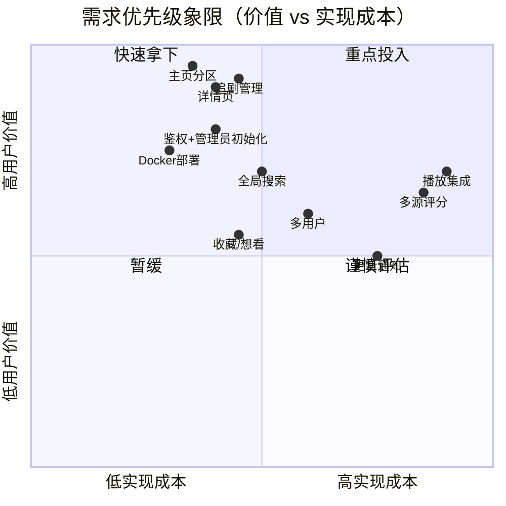

# CineOne 影视聚合应用 · 产品需求文档（简单 PRD）

| 项目信息 | 内容 |
| --- | --- |
| 文档语言 | 简体中文 |
| 技术栈 | 前端 Vite + React + Tailwind CSS；后端 Node.js + SQLite；Docker 单容器部署 |
| 项目名称 | `cineone` |
| 目标平台 | Web（桌面优先，响应式适配移动端） |
| 设计基准 | iOS Forward 应用视觉风格 + Apple HIG 规范 |
| 外部依赖 | TMDB API（用户自配 API Key） |

## 原始需求复述

开发一个个人/家庭自用的影视聚合应用：通过 TMDB API 聚合影视信息，主页展示新上电影/剧集、热门、经典等分区；提供追剧管理（记录看到第几集）；详情页展示多源评分（豆瓣、烂番茄、爆米花、TMDB）；UI 遵循 Apple HIG，深浅双主题、毛玻璃材质、SF Pro 字体栈、Remix Icon 图标；内置登录鉴权与首次启动的管理员初始化流程；支持 Docker 单容器部署。

---

## 一、产品目标

1. **一站式影视信息中枢**：以 TMDB 为数据底座，让家庭成员在一个界面内浏览新片、新剧、热门与经典内容，无需在多个网站间跳转。
2. **轻量可自托管**：Docker 单容器 + SQLite 零运维部署，个人 NAS / 家庭服务器 5 分钟内跑起来，数据完全本地化。
3. **原生级 Apple 质感体验**：以 Forward App 的视觉风格为参照，遵循 HIG 完成深浅双主题、毛玻璃、SF Pro 排版体系，达到"接近 iOS 原生应用"的 Web 体验。

---

## 二、用户故事

1. 作为**家庭管理员**，我想要在系统首次启动时设置管理员账号密码，以便只有家人能访问我们的私有影视库。
2. 作为**普通用户**，我想要在主页按"新上电影 / 新上剧集 / 热门 / 经典"分区浏览影视内容，以便快速发现想看的作品。
3. 作为**追剧用户**，我想要把正在追的剧加入追剧列表并标记"已看到第几集"，以便下次打开就能接着看。
4. 作为**选片决策者**，我想要在同一详情页对比豆瓣、烂番茄（Tomatometer）、爆米花（Popcornmeter）和 TMDB 四源评分，以便快速判断一部片值不值得看。
5. 作为**移动端用户**，我想要在手机上也能舒适地浏览和更新追剧进度，以便通勤路上随手管理。

---

## 三、需求池（P0 / P1 / P2）

> P0 = MVP 必须；P1 = 增强；P2 = 远期

### P0 — MVP 必须

| 编号 | 需求 | 说明 / 验收标准 |
| --- | --- | --- |
| P0-01 | TMDB 数据聚合 | 用户配置 API Key 后拉取电影/剧集列表与详情；断网或 Key 无效时给出明确错误提示 |
| P0-02 | 主页内容分区 | 新上电影 / 新上剧集 / 热门 / 经典 ≥4 个分区，横向卡片流，点击进入详情页 |
| P0-03 | 影视详情页 | 海报、简介、年份、类型、演职员；展示 TMDB 评分（豆瓣/烂番茄见 Open Questions） |
| P0-04 | 追剧管理 | 添加/移除追剧；修改"已看到第几集"；追剧页列表化展示并显示总集数进度 |
| P0-05 | 用户鉴权 | 登录/登出，会话保持，未登录访问受保护页面重定向到登录页 |
| P0-06 | 管理员初始化 | 首次启动检测无管理员账号 → 自动跳转初始化设置页（账号+密码），完成后不可重复进入 |
| P0-07 | 深浅双主题 | 默认深色沉浸主题，可切换浅色，偏好持久化 |
| P0-08 | Docker 部署 | 单容器 `docker run` 即可运行，SQLite 数据卷持久化 |

### P1 — 增强

| 编号 | 需求 | 说明 |
| --- | --- | --- |
| P1-01 | 全局搜索 | 按关键词搜索电影/剧集（TMDB search），支持模糊匹配与历史记录 |
| P1-02 | 收藏/想看 | 标记"想看"，独立收藏页 |
| P1-03 | 多源评分接入 | 豆瓣 / 烂番茄评分获取与缓存策略落地（依赖待确认问题的结论） |
| P1-04 | 多用户支持 | 管理员创建普通成员账号，追剧行数据按用户隔离 |
| P1-05 | 分类筛选与排序 | 主页分区按类型/年份筛选，追剧页按状态（在看/完结/弃剧）分组 |
| P1-06 | 图片缓存 | TMDB 图片本地缓存，提升二次加载速度与弱网体验 |

### P2 — 远期

| 编号 | 需求 | 说明 |
| --- | --- | --- |
| P2-01 | 播放集成 | 对接本地媒体库（如 Jellyfin/Emby/Plex）直接播放 |
| P2-02 | 更新通知 | 追剧的剧集有更新时推送提醒（Web Push / 邮件） |
| P2-03 | 观影记录与统计 | 已看清单、观看时长统计、年度报告 |
| P2-04 | 移动端体验深化 | PWA 安装、手势交互优化 |

### 需求优先级象限图

---

## 四、UI 设计方向

**整体气质**：参照 iOS Forward 应用的卡片式影视墙 —— 大海报、大圆角、留白克制、信息层级清晰；整体遵循 Apple HIG。

| 维度 | 设计规范 |
| --- | --- |
| 布局 | 桌面优先响应式：桌面端侧边导航栏（首页/追剧/搜索/设置）+ 内容区；窄屏折叠为底部 Tab 栏 |
| 主题 | 默认深色沉浸（近黑背景 + 高对比文字），支持一键切换浅色；跟随系统可选 |
| 材质 | 毛玻璃（backdrop-filter blur + 半透明层）应用于顶部导航、侧边栏、弹层；深色下用低透明度白色描边营造玻璃质感 |
| 字体 | SF Pro 字体栈（`-apple-system, BlinkMacSystemFont, "SF Pro Text"...`），标题 Semibold、正文 Regular，符合 Apple 字阶 |
| 图标 | Remix Icon 线性风格，统一 1px 视觉粗细，关键操作可用填充态表达选中 |
| 组件 | 自定义组件体系：影视卡片（海报+悬浮微缩放）、评分胶囊、进度条（追剧集数）、iOS 风格 Switch / Segmented Control |
| 动效 | 克制过渡（150–250ms ease-out）：页面淡入、卡片 hover 浮起、主题切换平滑渐变 |

---

## 五、待确认问题（Open Questions）

1. **豆瓣评分来源**：豆瓣无官方开放 API。方案候选：a) 第三方聚合接口；b) 定时爬取（合规风险）；c) 手动维护。倾向 a+c 兜底，需确认可接受的数据新鲜度与维护成本。
2. **烂番茄评分来源**：同样无官方 API，候选第三方聚合服务（如 OMDB 付费 Key 提供 Rotten Tomatoes 数据），是否接受付费依赖？
3. **TMDB API Key 归属**：使用团队公共 Key 还是每位部署者自行注册配置？影响开箱体验与配额。
4. **追剧粒度**："已看到第几集"是否需要精确到季（Season/Episode 二级），还是 MVP 仅按单季剧集处理？
5. **多用户范围**：MVP 是单管理员单账号，还是家庭多成员各自独立追剧行？（建议 MVP 单管理员，P1 扩展）
6. **经典分区定义**："经典"以什么标准取数？TMDB top rated + 年份阈值，还是人工策展？

---

*文档版本 v1.0 · 产品经理 Alice · 待架构评审*
